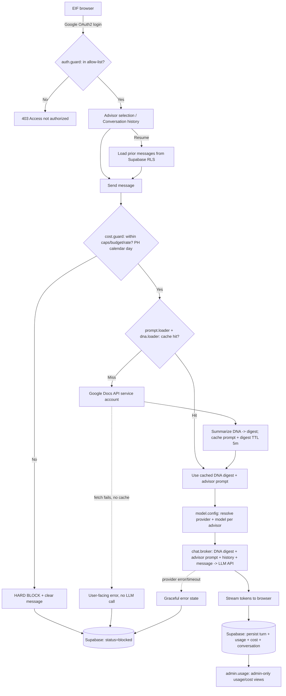

# PRD: Eskwelabs Internal AI Advisor Platform

- **Feature Name:** Eskwelabs Internal AI Advisor Platform
- **Doc Owner / Approver:** Aurelien Chu
- **Date / Version:** 2026-06-02 / v1.1
- **Timeline:** 2 weeks
- **Deployment target:** Vercel
- **Recommended stack:** Next.js (App Router) + TypeScript, Vercel Serverless/Edge Functions, NextAuth (Google OAuth2), Supabase (Postgres) for all persistence, Google Docs API (service account, read-only) for prompts + DNA, Vercel KV (or Supabase) for cache, multi-provider LLM (OpenAI / Google Gemini / Anthropic)

---

## 1) Problem, Goals & Non-Goals

### 1.1) Problem Statement

Eskwelabs runs EIF (intern) mentoring on third-party Custom GPTs and Google Gems. At current volume these cannot be centrally managed: system prompts are exposed and hard to iterate, conversations cannot be logged or analyzed, model and cost usage is uncontrollable, and there is no path to systematic prompt improvement. Eskwelabs needs an internally owned web platform that brokers EIF↔LLM conversations while retaining full control of prompts, logs, models, and spend — and that keeps advisor outputs on-brand via a shared Eskwelabs DNA reference.

### 1.2) Primary Goals

- Ship a web-based AI Advisor chat usable by ~100 allow-listed EIFs across 3 advisors.
- Keep advisor system prompts hidden from EIFs while editable by admins without redeployment (sourced live from Google Docs).
- Record and store every conversation for later analysis, and let EIFs see and resume their past conversations.
- Hard-cap per-user tokens/messages, daily/monthly budget, and request rate.
- Let admins choose which model(s) are available (per advisor) and view usage/cost.
- Keep advisor tone/voice on-brand by grounding every advisor in a shared Eskwelabs DNA knowledge base.

### 1.3) Success Metrics / KPIs

| KPI                                             | Target (MVP)                                          |
| ----------------------------------------------- | ----------------------------------------------------- |
| Allow-listed EIFs able to authenticate and chat | ≥ 95%                                                 |
| Completed turns persisted without loss          | ≥ 99%                                                 |
| Past conversations resumable                    | 100% of stored conversations reopen with full history |
| Prompt/DNA update propagation (Doc edit → live) | ≤ cache TTL (5 min), zero redeploy                    |
| Over-limit requests hard-blocked                | 100%                                                  |
| Client-side system-prompt / DNA exposures       | 0 (verified via network inspection)                   |
| Pilot uptime                                    | ≥ 99%                                                 |

### 1.4) Non-Goals / Out of Scope

- Mobile-native apps (responsive web only).
- EIF-facing analytics/usage dashboards (usage/cost is admin-only; deep analytics is post-MVP).
- Autonomous/agentic tool use by advisors (advisory text only).
- Fine-tuning or vector RAG (DNA is injected as a summarized digest, not retrieved per chunk, at MVP).
- In-app prompt editor (prompts and DNA edited only in Google Docs by design).

---

## 2) Users & Use Cases

### 2.1) Target Personas

**EIF (primary):** junior intern/apprentice; authenticates with an allow-listed Google account, selects an advisor, chats, and can revisit/resume prior conversations. Never sees system prompts, DNA, costs, or other users' data.

**Eskwelabs Admin (secondary):** edits prompts and the DNA Doc in Google Docs; configures which model is available per advisor; views aggregate and per-user usage/cost. No in-app prompt editing.

**Future developer:** inherits and extends the codebase.

### 2.2) Top Use Cases / Scenarios

1. EIF logs in via Google, picks the Data Dashboard Advisor, and gets step-by-step Looker Studio mentoring in Eskwelabs' voice.
2. EIF uses the SSOT Memo Advisor for templates and interview guides toward an SSOT memo.
3. EIF returns the next day, opens their conversation history, and resumes a prior thread with full context.
4. Admin edits an advisor's Doc or the DNA Doc; new behavior goes live within the TTL with no redeploy.
5. Admin sets a different model per advisor.
6. EIF hits a daily token cap mid-session and is hard-blocked with a clear message.
7. Admin reviews per-user token counts and estimated spend.

### 2.3) Constraints & Assumptions

- 14-day build, engineers using AI coding assistants → favor managed services (Supabase, Vercel), minimal custom infra.
- Vercel hosting → stateless serverless functions, respect timeout limits, stream responses.
- Google Docs as the prompt/DNA control plane → tolerate quota/latency; mitigate with TTL caching.
- Supabase as the system of record → conversation history and analytics in Postgres; use row-level security so EIFs can read only their own conversations.
- Secrets (provider keys, service-account creds, Supabase service key) only in Vercel environment variables.

### 2.4) Functional Requirements (FRs)

| ID    | User Story                                                                                                 | Description                                                                                                                           | Priority | Acceptance Criteria                                                                                                                                                                      | Dependencies                     |
| ----- | ---------------------------------------------------------------------------------------------------------- | ------------------------------------------------------------------------------------------------------------------------------------- | -------- | ---------------------------------------------------------------------------------------------------------------------------------------------------------------------------------------- | -------------------------------- |
| FR-01 | As an EIF, I want to log in with my Google account so that only authorized interns can use the platform.   | Google OAuth2 login restricted to a static allow-list stored in Supabase.                                                             | Must     | Given a non-allow-listed account, When it attempts login, Then access is denied with a clear message; Given an allow-listed account, When it logs in, Then it reaches advisor selection. | Google OAuth2, allow-list table  |
| FR-02 | As an EIF, I want to choose an advisor and hold a multi-turn chat so that I get role-specific mentoring.   | Advisor picker + streamed multi-turn chat for 3 advisors.                                                                             | Must     | Given a logged-in EIF, When they select an advisor and send messages, Then they receive coherent multi-turn replies scoped to that advisor.                                              | FR-01, FR-03                     |
| FR-03 | As an admin, I want system prompts + DNA injected server-side so that EIFs never see them.                 | Server injects DNA digest + advisor's Doc-sourced prompt into every LLM call; neither reaches the client.                             | Must     | Given any chat turn, When the response/headers/errors are inspected client-side, Then no system prompt or DNA text is present.                                                           | FR-04, FR-14                     |
| FR-04 | As an admin, I want prompts fetched live from a Google Doc so that I can update them without redeployment. | One Doc per advisor fetched via Docs API (service account), cached with 5-min TTL.                                                    | Must     | Given an admin edits an advisor's Doc, When the TTL elapses (or cache is refreshed), Then new behavior is live with no redeploy.                                                         | Docs API, service account, cache |
| FR-05 | As an admin, I want every turn persisted so that I can analyze interactions.                               | Append each turn + metadata to Supabase (messages).                                                                                   | Must     | Given a completed/blocked/errored turn, When it finishes, Then a row with required fields is written to Supabase.                                                                        | Supabase                         |
| FR-06 | As an admin, I want hard caps on usage and spend so that costs stay controlled.                            | Per-user message/token caps + daily/monthly budget ceilings, enforced server-side. Daily reset = calendar day, PH time (Asia/Manila). | Must     | Given a user/global limit is reached, When a new request is made, Then it is hard-blocked, no provider call occurs, and the block is logged.                                             | Cost guard, limits config        |
| FR-07 | As an admin, I want rate limiting so that bursts cannot overwhelm cost or providers.                       | Per-user and global request rate limits.                                                                                              | Must     | Given a user exceeds the rate limit, When they send another request, Then it is hard-blocked with retry guidance and logged.                                                             | Cost guard                       |
| FR-08 | As an admin, I want to configure the model per advisor so that I control which model each advisor uses.    | Admin sets provider/model per advisor; applied at call time.                                                                          | Must     | Given an admin changes an advisor's model, When an EIF next chats with that advisor, Then the new model is used and recorded.                                                            | Provider adapters, model config  |
| FR-09 | As an admin, I want to view usage and estimated cost (admin-only) so that I can monitor spend.             | Per-user and aggregate usage/cost views from Supabase; not visible to EIFs.                                                           | Must     | Given logged turns exist, When the admin opens the usage view, Then per-user and aggregate tokens and estimated cost are shown; EIFs have no access.                                     | FR-05                            |
| FR-10 | As an EIF, I want streamed responses so that replies feel fast.                                            | Token-by-token streaming to the UI.                                                                                                   | Should   | Given a chat turn, When the model responds, Then tokens render incrementally with first token ≤ ~3s under normal latency.                                                                | Provider streaming               |
| FR-11 | As an EIF, I want to be told my chats are logged so that monitoring is transparent.                        | First-run consent/notice + persistent footer note.                                                                                    | Must     | Given a first login, When the app loads, Then a logging/monitoring notice is shown and acknowledged.                                                                                     | —                                |
| FR-12 | As an EIF, I want graceful errors so that failures are understandable.                                     | Handle provider/Doc/Supabase failures with clear UI states.                                                                           | Must     | Given a provider/Doc/Supabase failure, When it occurs, Then the user sees a clear error state and the event is logged.                                                                   | FR-04, FR-05                     |
| FR-13 | As an admin, I want a manual cache refresh so that I can push prompt/DNA edits immediately.                | Admin action to invalidate the prompt + DNA cache before TTL.                                                                         | Should   | Given an admin triggers refresh, When the next turn runs, Then the latest Doc/DNA content is used.                                                                                       | FR-04, FR-14                     |
| FR-14 | As an admin, I want a shared Eskwelabs DNA grounding so that all advisors stay on-brand.                   | DNA Doc (~30 pp) summarized into a compact digest, cached (5-min TTL), prepended to every advisor's system prompt.                    | Must     | Given the DNA Doc is updated, When the cache refreshes, Then the regenerated digest grounds all advisor replies; DNA text never reaches the client.                                      | Docs API, summarizer, cache      |
| FR-15 | As an EIF, I want to see and resume my past conversations so that I can continue work across sessions.     | Conversation list (per user) + reopen with full message history restored into context.                                                | Must     | Given a returning EIF, When they open history and select a conversation, Then prior messages render and new turns continue with that context.                                            | Supabase, RLS, FR-02             |

### 2.5) Non-Functional Requirements (NFRs)

| Category                    | Requirement                                         | Target / Threshold                                                   | How Measured                                        | Notes                                                     |
| --------------------------- | --------------------------------------------------- | -------------------------------------------------------------------- | --------------------------------------------------- | --------------------------------------------------------- |
| Latency                     | p95 first-token time                                | ≤ ~3 s under normal provider latency                                 | Server timing logs                                  | Streaming masks total generation time                     |
| Cost                        | Avg cost per call                                   | Within configured per-user/global ceilings                           | Token counts × model rate table                     | DNA digest adds fixed per-turn tokens — keep digest tight |
| Reliability/Availability    | Uptime during pilot                                 | ≥ 99%                                                                | Vercel/Supabase monitoring                          | Stateless serverless + managed Postgres                   |
| Security & Privacy          | Keys, prompt & DNA secrecy; per-user data isolation | 0 client exposures; EIFs read only their own conversations           | Network inspection, code review, Supabase RLS tests | Secrets in env vars only                                  |
| Safety/Policy               | Logging consent shown                               | 100% of users see notice                                             | First-run flow check                                | Transparency requirement                                  |
| Observability               | Required logs present                               | All events in §8 captured                                            | Supabase query                                      | Structured server logs                                    |
| Maintainability             | Prompt/versioning                                   | Prompts + DNA in Docs; Doc revision logged per turn                  | Repo + log review                                   | No redeploy for prompt/DNA edits                          |
| Scalability                 | Concurrent EIFs                                     | ~100 with bursty concurrency                                         | Load check                                          | Postgres handles history/log volume comfortably           |
| Accessibility & i18n        | A11y level                                          | Reasonable WCAG-aware web defaults (full A11y post-MVP)              | Manual check                                        | English only at MVP                                       |
| Explainability/Auditability | Audit trail                                         | Each turn ties to Doc revision + DNA digest version + model + tokens | Supabase review                                     | No source citations at MVP (no vector RAG)                |

---

## 3) Data & Knowledge Sources

### 3.1) Knowledge Base / Reference Files

- **Eskwelabs DNA (shared KB):** one Google Doc (~30 pages) — the single structured reference for Eskwelabs identity: core identity (mission, values, organizational framework), communication voice & institutional email posture, product-line definitions & learning architecture, diagnostic-first LXD principles, and lexicon/formatting guardrails. Summarized into a compact DNA digest that is prepended to every advisor's system prompt. DNA Doc: `{{dna_doc_url}}`
- **Prompt source (per advisor):** one Google Doc per advisor (3 total). The Doc body is the advisor-specific system prompt.
- **No vector RAG at MVP.** Advisors rely on DNA digest + advisor prompt + conversation context.
- **Advisor registry:** server-side config mapping advisorId → { name, docId, model }; not exposed to EIFs beyond display name.
  - Data Dashboard Advisor Doc: `https://docs.google.com/document/d/1mZX8QwMhHDYG_jjH2CMCCr5oqChjrlJo1muVdmhxki0/edit?usp=sharing`
  - SSOT Memo Advisor Doc: `https://docs.google.com/document/d/1FX1A1399qjTNLT397HVqSpFHvBVpnKFSpJClTrap2JA/edit?usp=sharing`
  - Data Modeling Advisor Doc: `https://docs.google.com/document/d/1JjqZoSoX1PuFFFzpDLB7A7YE2k8--0UzmMTO2bGggJw/edit?usp=sharing`

#### DNA Digest Handling (FR-14)

Full 30-page DNA is not injected per turn (cost + latency). Instead the system fetches the DNA Doc, generates a compact digest (target: a few hundred tokens covering voice, lexicon, formatting guardrails, and identity essentials), and caches it.

**Regeneration:** on cache miss/TTL expiry or manual admin refresh. The digest version is recorded per turn for auditability.

The digest is held server-side only and prepended to the system message ahead of the advisor-specific prompt.

### 3.2) Data Governance

**PII handling & redaction:** Persist only what's needed (timestamp, plaintext user email, advisor id, conversation id, model, role, message text, token counts, estimated cost, latency, status). System prompt and DNA text are never persisted in logs — reference Doc revision + digest version instead. Plaintext email is acceptable to admins (resolved; no hashing required at MVP).

**Access control:** Google OAuth2 allow-list (static list in Supabase) for EIFs; Supabase row-level security ensures each EIF can read only their own conversations; usage/cost is admin-only. Prompt + DNA Docs shared only with admins + the read-only service account. Provider keys, service-account creds, and the Supabase service-role key only in Vercel env vars. First-run notice informs EIFs that conversations are logged/monitored for performance purposes.

---

## 4) Prompting & Model Configuration

### 4.1) Prompt Registry

| Prompt                 | URL                                                                                                | Purpose                                                                                           | Owner | Version                       | Parameters                                           |
| ---------------------- | -------------------------------------------------------------------------------------------------- | ------------------------------------------------------------------------------------------------- | ----- | ----------------------------- | ---------------------------------------------------- |
| Eskwelabs DNA (shared) | `https://docs.google.com/document/d/1jQCF3lhyjAKbyEnK1fwDIalW05l8W5TJTZnaKZ9Tktw/edit?usp=sharing` | Brand/voice/lexicon grounding prepended to all advisors (as summarized digest)                    | Admin | Doc revision + digest version | Applies to every advisor                             |
| Data Dashboard Advisor | `https://docs.google.com/document/d/1mZX8QwMhHDYG_jjH2CMCCr5oqChjrlJo1muVdmhxki0/edit?usp=sharing` | Looker Studio/UX mentoring; advisory only — guides apprentice to build a decision-ready dashboard | Admin | Doc revision                  | Model: admin-set per advisor; temp: default/Doc hint |
| SSOT Memo Advisor      | `https://docs.google.com/document/d/1FX1A1399qjTNLT397HVqSpFHvBVpnKFSpJClTrap2JA/edit?usp=sharing` | KM/strategy mentoring; templates & interview guides toward an SSOT memo; advisory only            | Admin | Doc revision                  | Model: admin-set per advisor; temp: default/Doc hint |
| Data Modeling Advisor  | `https://docs.google.com/document/d/1JjqZoSoX1PuFFFzpDLB7A7YE2k8--0UzmMTO2bGggJw/edit?usp=sharing` | Data modeling, schema design, and analytics architecture mentoring; advisory only                 | Admin | Doc revision                  | Model: admin-set per advisor                         |

#### Prompt/DNA Loading Rules

- Cache keys = `advisorId` (prompt) and `dna_digest` (DNA). TTL = 5 min (confirmed). Manual admin refresh invalidates keys.
- On Doc-fetch failure: serve last good cached value; if none, return a user-facing error and do not call the LLM.
- Final system message = DNA digest + advisor-specific prompt, assembled server-side only.

---

## 5) Flow Chart

### 5.1) High-Level Data → AI Flow



### 5.2) Responsibilities (RACI)

| Step                                     | Owner                   | Backup | Notes                                     |
| ---------------------------------------- | ----------------------- | ------ | ----------------------------------------- |
| Author/edit advisor prompts + DNA (Docs) | Admin                   | Eng    | Source of truth; no in-app editor         |
| Configure model per advisor              | Admin                   | Eng    | Applied at call time                      |
| Authenticate & chat                      | EIF                     | —      | Static allow-list enforced                |
| Read prompts + DNA from Docs             | Service account         | Eng    | Read-only; TTL cache + last-good fallback |
| Summarize DNA into digest                | Eng (system)            | Admin  | Regenerated on refresh/TTL                |
| Persist conversations & logs             | Eng (system) → Supabase | Eng    | RLS isolates per-user history             |
| Resume past conversations                | EIF                     | Eng    | Reads own conversations only              |
| Enforce cost caps & rate limits          | Eng (system)            | Admin  | Hard block; PH calendar-day reset         |
| Monitor usage/cost                       | Admin                   | Eng    | Admin-only                                |

---

## 6) Sample Inputs & Outputs

### 6.1) Representative Inputs

1. EIF → Data Dashboard Advisor: "I have sales data by region and month. How should I structure a decision-ready Looker Studio dashboard?"
2. EIF → SSOT Memo Advisor: "Help me build an interview guide to extract our onboarding process into an SSOT memo."
3. Returning EIF: opens history, reopens yesterday's dashboard thread, and asks a follow-up.

### 6.2) Expected Outputs

- **Data Dashboard Advisor:** advisory, step-by-step plan + layout template + guiding questions, in Eskwelabs' voice; explicitly tells the EIF to build the final deliverable themselves.
- **SSOT Memo Advisor:** a reusable interview-guide template + structuring feedback; the EIF remains responsible for the final memo.
- Both stream to the UI; the full turn is persisted with token/cost metadata and attached to the conversation.

#### Internal Turn-Log Record (illustrative)

```json
{
  "status": "ok",
  "turn_id": "uuid",
  "conversation_id": "uuid",
  "advisor_id": "data-dashboard",
  "model": "<admin-selected-per-advisor>",
  "prompt_tokens": 0,
  "completion_tokens": 0,
  "est_cost_usd": 0.0,
  "prompt_doc_revision": "<doc-rev-id>",
  "dna_digest_version": "<digest-hash>"
}
```

### 6.3) Negative & Edge Cases

| Case                                              | Expected behavior                                                                   |
| ------------------------------------------------- | ----------------------------------------------------------------------------------- |
| Non-allow-listed Google account                   | Blocked at login with a clear message.                                              |
| Daily/monthly budget exceeded                     | Hard block; message states cap + reset window (PH calendar day); logged as blocked. |
| Rate limit exceeded                               | Hard block with retry-after guidance; logged.                                       |
| Google Doc (prompt or DNA) unreachable, no cache  | User-facing error; no LLM call; error logged.                                       |
| Provider API error/timeout                        | Graceful error state; partial stream handled; logged as error.                      |
| Supabase write fails                              | Retry; never silently drop; surface/log failure.                                    |
| EIF tries to open another user's conversation     | Blocked by RLS; not returned.                                                       |
| EIF asks for the system prompt or DNA             | Advisor declines; server never returns prompt/DNA.                                  |
| EIF asks advisor to produce the final deliverable | Advisor stays advisory and redirects (per prompt design).                           |

---

## 7) Evaluation

### 7.1) Evaluation Rubric

| Criterion                      | 1 — Poor                         | 3 — Acceptable                  | 5 — Excellent                                                | Weight |
| ------------------------------ | -------------------------------- | ------------------------------- | ------------------------------------------------------------ | ------ |
| Task success / relevance       | Off-role or unhelpful replies    | Mostly on-role, usable guidance | Consistently on-role, decision-ready mentoring               | 0.20   |
| Brand/voice fidelity (DNA)     | Ignores Eskwelabs voice/lexicon  | Generally on-brand              | Reliably on-brand voice, lexicon, formatting                 | 0.15   |
| Factual accuracy / grounding   | Frequent errors                  | Generally accurate              | Accurate, well-reasoned guidance                             | 0.10   |
| Policy & safety compliance     | Leaks prompt/DNA or ignores caps | Mostly compliant                | Prompt/DNA secrecy + caps fully enforced                     | 0.20   |
| Instruction & format adherence | Ignores advisory-only role       | Usually advisory                | Always advisory; never produces final deliverable            | 0.15   |
| Clarity & tone                 | Confusing                        | Clear enough                    | Clear, mentoring, well-structured                            | 0.05   |
| Robustness                     | Crashes on errors/edge cases     | Handles common failures         | Graceful across all edge cases in §6.3 (incl. RLS isolation) | 0.15   |

### 7.2) Pass Criteria

- All **Must** FRs (FR-01–FR-09, FR-11, FR-12, FR-14, FR-15) working end-to-end for all 3 advisors.
- Prompt/DNA secrecy and cost hard-block verified by adversarial test.
- Per-user conversation isolation verified (RLS: one EIF cannot read another's history).
- 100 allow-listed accounts can log in; non-listed blocked.
- Prompt/DNA edit → live within 5-min TTL with no redeploy, demonstrated live.
- Past conversations reopen with full history and resume correctly.
- Logs populate correctly in Supabase for ok/blocked/error turns.
- Weighted rubric score ≥ 3.5 / 5 across representative sessions.

---

## 8) Telemetry, Ops & Cost

### Events to Log

`login_success`, `login_denied`, `advisor_selected`, `conversation_resumed`, `message_sent`, `llm_call_started`, `llm_call_completed`, `request_blocked` (reason: cap/budget/rate), `prompt_cache_hit`, `prompt_cache_miss`, `dna_digest_regenerated`, `doc_fetch_error`, `provider_error`, `supabase_write_error`, `admin_model_changed`, `admin_cache_refresh`.

### Supabase Schema

#### `users` — allow-list + identity

| Column       | Type          | Description                      |
| ------------ | ------------- | -------------------------------- |
| `id`         | uuid (pk)     | User id                          |
| `email`      | text (unique) | Plaintext email (allow-list key) |
| `role`       | text          | eif / admin                      |
| `is_active`  | bool          | Allow-list toggle                |
| `created_at` | timestamptz   | —                                |

#### `conversations` — one row per thread

| Column                      | Type              | Description                                |
| --------------------------- | ----------------- | ------------------------------------------ |
| `id`                        | uuid (pk)         | Conversation id                            |
| `user_id`                   | uuid (fk → users) | Owner (RLS scope)                          |
| `advisor_id`                | text              | data-dashboard / ssot-memo / data-modeling |
| `title`                     | text              | Auto/first-message derived                 |
| `created_at` / `updated_at` | timestamptz       | For history ordering / resume              |

#### `messages` — one row per turn (chat history + analytics)

| Column                | Type                      | Description                           |
| --------------------- | ------------------------- | ------------------------------------- |
| `id`                  | uuid (pk)                 | Turn id                               |
| `conversation_id`     | uuid (fk → conversations) | Thread                                |
| `user_id`             | uuid (fk → users)         | Owner (RLS scope)                     |
| `role`                | text                      | user / assistant                      |
| `content`             | text                      | Message text (no system prompt / DNA) |
| `provider`            | text                      | openai / google / anthropic           |
| `model`               | text                      | Model id used                         |
| `prompt_tokens`       | int                       | Input tokens                          |
| `completion_tokens`   | int                       | Output tokens                         |
| `est_cost_usd`        | numeric                   | token counts × model rate             |
| `latency_ms`          | int                       | Provider round-trip                   |
| `status`              | text                      | ok / blocked / error                  |
| `block_reason`        | text                      | cap / budget / rate (if blocked)      |
| `prompt_doc_revision` | text                      | Doc revision used (not the text)      |
| `dna_digest_version`  | text                      | Digest hash/version used              |
| `created_at`          | timestamptz               | —                                     |

#### `usage_counters` — fast cap enforcement

| Column                | Type              | Description               |
| --------------------- | ----------------- | ------------------------- |
| `user_id`             | uuid (fk → users) | —                         |
| `day_ph`              | date              | Calendar day, Asia/Manila |
| `messages_today`      | int               | Per-user daily count      |
| `tokens_today`        | int               | Per-user daily tokens     |
| `est_spend_today_usd` | numeric           | Per-user daily spend      |

#### `model_config` — admin model selection per advisor

| Column       | Type        | Description     |
| ------------ | ----------- | --------------- |
| `advisor_id` | text (pk)   | Advisor         |
| `provider`   | text        | Active provider |
| `model`      | text        | Active model    |
| `updated_by` | text        | Admin email     |
| `updated_at` | timestamptz | —               |

**RLS:** EIFs may select only rows where `user_id = auth.uid()` in conversations / messages. Admin role bypasses for usage/cost views.

### Cost Config

- **Per-model rate table** (server config): `{ provider, model, input_$per_1k, output_$per_1k }` — validate current rates before launch.
- **Per-user counters** (PH calendar day): messages today, tokens today, est. spend today; monthly spend aggregated.
- **Global counters:** total spend today/month vs. ceilings.
- **Limits config** (admin-set): `max_messages_per_user_per_day`, `max_tokens_per_user_per_day`, `daily_budget_usd`, `monthly_budget_usd`, `rate_limit_per_minute`. Reset = calendar day, Asia/Manila. Breach → hard block.

---

## 9) Open Questions & Risks

### 9.1) Open Questions

| Question                                                                                                        | Status                                                  |
| --------------------------------------------------------------------------------------------------------------- | ------------------------------------------------------- |
| What is the 3rd advisor (purpose, opening prompt, Doc)? Only two are specified.                                 | **OPEN**                                                |
| Allow-list source                                                                                               | Resolved: static list stored in Supabase (users table)  |
| Cap/budget reset semantics                                                                                      | Resolved: calendar day, PH time (Asia/Manila)           |
| Prompt cache TTL                                                                                                | Resolved: 5 minutes (applies to prompts and DNA digest) |
| Retention policy for conversation history + logs after the pilot                                                | **OPEN**                                                |
| EIF self-usage visibility                                                                                       | Resolved: admin-only; EIFs do not see usage/cost        |
| Model granularity                                                                                               | Resolved: per-advisor model selection                   |
| Email hashing                                                                                                   | Resolved: plaintext email acceptable; no hashing at MVP |
| Exact cap/budget values (max_messages_per_user_per_day, token caps, daily/monthly USD ceilings, rate-limit/min) | **OPEN**                                                |

### 9.2) Risks & Mitigations

| Risk                                       | Impact                          | Mitigation                                                                                                |
| ------------------------------------------ | ------------------------------- | --------------------------------------------------------------------------------------------------------- |
| DNA digest drift / lossy summary           | Off-brand or missing guardrails | Keep digest tight but include lexicon/formatting rules verbatim; version + log digest; allow admin review |
| Per-turn token cost from DNA digest        | Higher cost on every call       | Cap digest size; monitor avg tokens/call; tune length                                                     |
| Prompt/DNA leakage to client               | Loss of IP/control              | Server-only assembly; adversarial test; never in responses/errors                                         |
| Cross-user history exposure                | Privacy breach                  | Supabase RLS on conversations/messages; test isolation explicitly                                         |
| Provider cost overrun                      | Budget blown                    | Server-side hard caps + budget ceilings + rate limits; pre-call estimation; global kill via ceiling       |
| Doc fetch failure / quota                  | Advisors unusable               | TTL cache + last-good fallback + manual refresh; clear error if no cache                                  |
| Serverless timeouts on long generations    | Truncated replies               | Stream responses; cap max output tokens                                                                   |
| 2-week timeline                            | Scope slip                      | Lock MVP to Must FRs; Supabase + Vercel reduce infra work; defer vector RAG / analytics dashboards        |
| Service-account or Supabase key compromise | Data exposure                   | Least-privilege scopes; keys only in env; rotate; restrict Doc sharing; RLS                               |
| Inaccurate cost estimates (pricing drift)  | Mis-set budgets                 | Maintain rate table; validate against provider billing periodically                                       |

---

---

## Blueprint for Updating This File

When business requirements change:

1. **FRs table** — add/remove rows, adjust priorities (MoSCoW), update acceptance criteria
2. **NFRs table** — add new categories or update targets
3. **§6.3 Edge cases** — add new negative scenarios as they're discovered
4. **§8 Schema** — add new columns/tables when the data model evolves
5. **§9 Open Questions** — resolve items as decisions are made, add new ones
6. **§7 Rubric** — adjust criteria/weights as evaluation matures
7. **Scope section** — flag new non-goals as they emerge

Also sync changes to:

- `AGENTS.md` (Env Vars, Database Tables, FR references)
- `DATABASE.md` (new tables/columns)
- `CHANGE_PROCESS.md` (new edge cases, new business rules)

## Future Scalability Considerations

- Add an analytics layer over Supabase (failure-mode tagging, prompt A/B testing, per-advisor effectiveness)
- Upgrade DNA from a summarized digest to true vector RAG for finer grounding
- Per-advisor provider fallback
- Optional in-app admin panel for limits/model config (prompts + DNA can remain in Docs)
- Conversation search/export for EIFs
